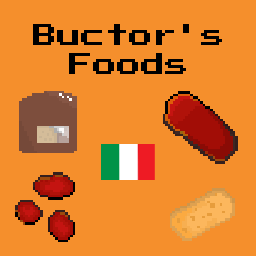
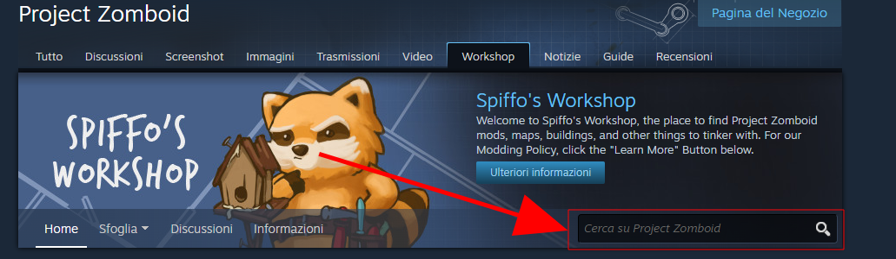
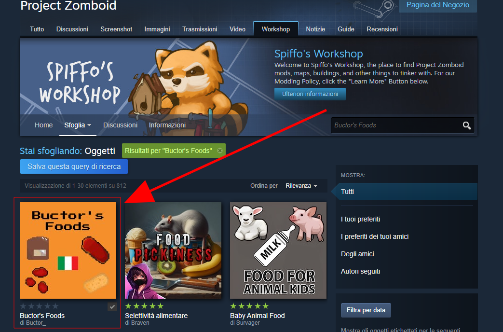
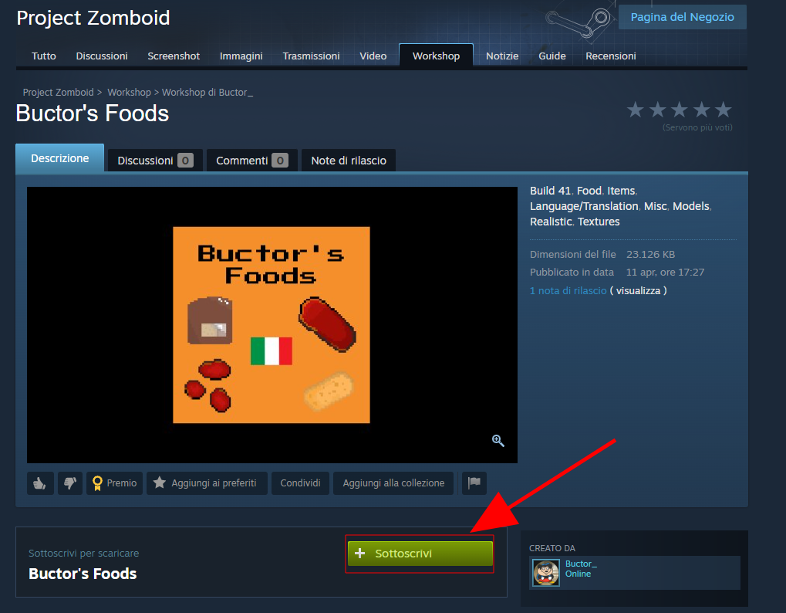
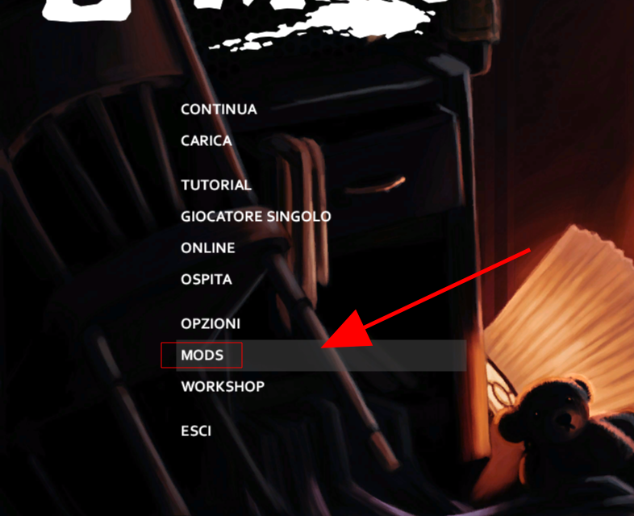
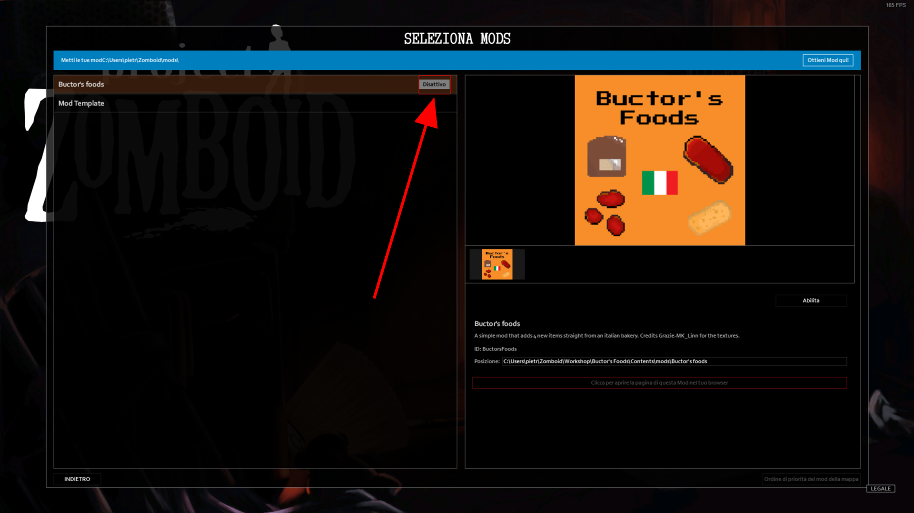

## Introducing 

# Buctor's Foods

#### A simple Project Zomboid mod that adds 3 new foods straight from the italian bakery and a Bakery bag that when opened, gives the player one of the three foods, for a total of 4 new items.

## The new items:

### -Pizza Rossa: 
A pizza without any cheese, just tomato sauce and a lot of oil.


### -Pizzette: 
Smaller versions of the Pizza Rossa.

### -Focaccia(flatbread in english): 
A simple type of pizza without any toppings or sauces, but with a lot of flavour and a lot of oil.


### -BakeryBag: 
An item inspired by the paper bag used to pack bread for customers in italian bakeries. When you open it, it will randomly add to the player's inventory, one of the three items and a paper bag.

## Where can I find the new items?
As you can see from the procedural distribution file, all of the items have a higher chance of spawning in the dry section of every kitchen and also in the dry section of gigamart. You can also find them in bakeries and other restaurants.

# How to install the mod
## Steam Workshop
On the steam launcher, navigate to the Project Zomboid page in your Steam library. In the bar under the play button click on the workshop section.


Then it will open the Project Zomboid workshop page. Go to the search bar and type "Buctor's Foods".


Type enter and a new page will pop up, with the list of all mods that corrispond to that name. You should find a mod called "Buctor's Foods". Click on it.


When the mod's page has been opened, just click on the subscribe button to install the mod. A download of some content for project zomboid will start.


Click this [link](https://steamcommunity.com/sharedfiles/filedetails/?id=3461991101) to visit the page

## Manual installation
Head to the release tab here on github and download the zip file. Extract it and copt the whole folder. Head to:
```
C:\Users\YOURUSER\Zomboid
```
and navigate to your mods folder. Once you are inside of it, paste the folder you prevously extracted and copied. 

# How to enable the mod in-game
Once opened, head to the mods section of the main menu.\


Once there you will find a list of different mods, if this is the first mod that you install, you will only see to items in the list. Hover on the "Buctor's Foods" one. There will be a button that is by default greyed out that says "Disabled"


If you click on the button you it will become green with "Enabled" written on it.
 

The mod is now enabled for all of your next games(If you only want to enable it for a specific new save, instead of going to the mods section, when you create a new game, you will be able to choose the mods to enable only for that specific game). When you go back to the main menu, the game will freeze for a bit, don't worry, it's normal, since the game is reloading the lua scripts to include the one in the mod.

## Future Updates
For the future I'm planning on introducing the worldStaticModels for all of the items, but for now besides the BakeryVag, they all use vanilla ones.

# Conclusion
If you downloaded the mod, thank you for your support. I invite you to add a star to repo and most importantly on the Workshop page for the mod.

Credits to Grazie-MK_Linn for the textures and the support ❤️

Developed by Buct0r🐱